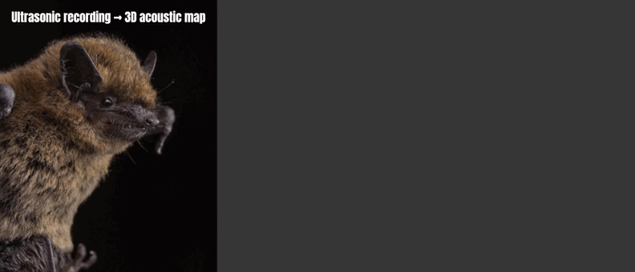

# Bat Spectrum

**Bat Spectrum** is an audiovisual research project that transforms bat recordings into animated acoustic maps.

The project analyses a selected bat audio file, detects ultrasonic pulse events, extracts acoustic features, and converts them into a 3D visual system rendered in Blender.

The goal is not to create a literal scientific visualization only, but a hybrid between analysis, archive, and audiovisual interpretation.



```text
bat recording
↓
audio analysis
↓
pulse detection
↓
acoustic features
↓
3D node map
↓
animated Blender render
↓
archived visual result
```

## Installation

Create and activate a Python virtual environment:

```powershell
python -m venv .venv
.\.venv\Scripts\Activate.ps1
```

Install the Python dependencies:

```powershell
pip install -r requirements.txt
```

Blender is required for the final 3D scene generation and rendering stage.

The repository does not include the temporary active audio file. To run the pipeline, copy a recording into:

```text
data/raw_audio/current_audio.wav
```

## Main workflow

1. Copy a source recording into `data/raw_audio/current_audio.wav`.
2. Run `python src/analyze_single_audio.py`.
3. Run `python src/export_blender_scene.py`.
4. Run `python src/create_render_audio.py`.
5. Open `blender/bat_spectrum_template.blend` and run `blender/animate_bat_spectrum.py`.
6. Render the animation from Blender.

## Project structure

```text
bat-spectrum/
  blender/
    animate_bat_spectrum.py
    bat_spectrum_template.blend
  data/
    raw_audio/
    exports/
    processed/
    clean/
  docs/
    bat-spectrum-preview.svg
    dataset_notes.md
    research_notes.md
    visual_system.md
  src/
    analyze_single_audio.py
    audio_analysis.py
    clean_current_audio.py
    create_render_audio.py
    export_blender_scene.py
  visuals/
    renders/
```

## Scripts

### `src/analyze_single_audio.py`

Analyses the current audio file and detects bat-like pulse events.

### `src/export_blender_scene.py`

Converts detected pulse data into a Blender-friendly JSON scene.

### `src/create_render_audio.py`

Converts the current audio into a render-friendly 48 kHz WAV file for Blender and video export.

### `src/clean_current_audio.py`

Creates a bat-focused cleaned version of the current audio.

### `src/audio_analysis.py`

Exploratory helper script for inspecting audio, spectrograms, and acoustic behaviour.

## Data philosophy

The project separates source audio, temporary working audio, generated exports, and archived renders. The original source audio is never overwritten by the analysis, cleaning, or rendering scripts.

## Notes on species and detection

Detection settings may need to change depending on the species, the recording device, and the amount of noise in the file.

Noisy recordings are not automatically treated as valid bat material. If a recording appears to contain camera handling, movement, human noise, or uncertain events, it can be discarded instead of archived as a final render.

## Blender

Blender is used as the final visual rendering environment. The generated `.blend` file is ignored because it can be recreated by the script.

## License and sources

Audio files should only be added when their source and license are clear. See `LICENSE.md` for usage terms.
